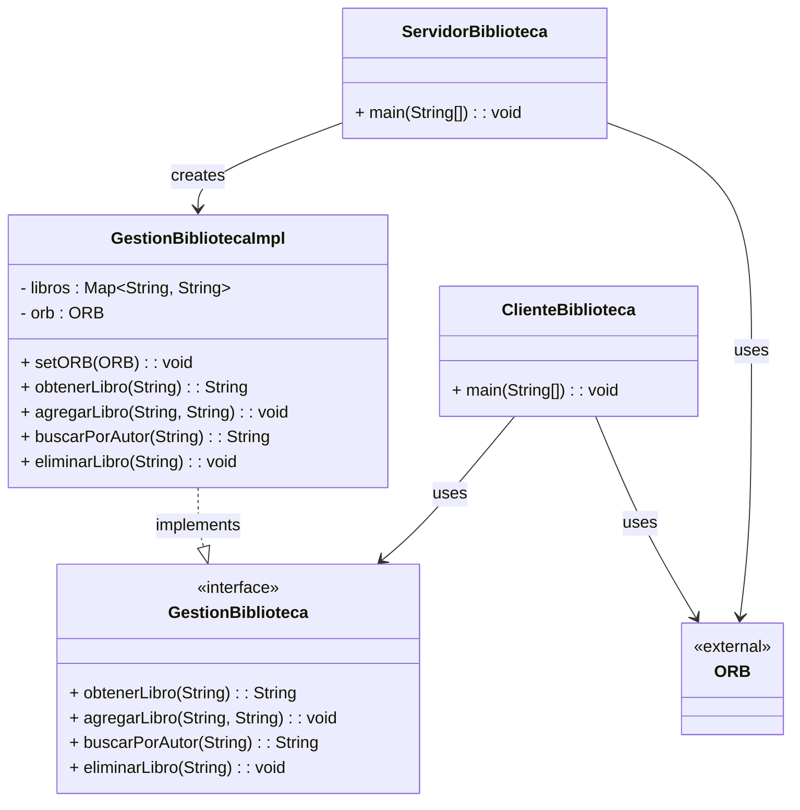

# Distribuidos3

Este proyecto implementa una aplicación cliente-servidor usando CORBA (Common Object Request Broker Architecture) para gestionar una biblioteca distribuida. Permite al cliente conectarse remotamente al servidor para realizar operaciones sobre libros.

## Requisitos

- Java Development Kit (JDK) versión 8 (ej.: OpenJDK, Oracle JDK, Amazon Corretto)
- ORB compatible con CORBA (el incluido en JDK es suficiente)
- Editor: IntelliJ IDEA / Eclipse

## Compilación y ejecución

### 1️. Generar las clases CORBA

Desde la carpeta donde se encuentra `Biblioteca.idl`:

```bash
idlj -fall Biblioteca.idl
```

### 2️. Compilar el servidor y cliente

```bash
javac ServidorBiblioteca.java
javac ClienteBiblioteca.java
```

### 3️. Ejecutar la aplicación

Abrir tres terminales:

**a. Naming Service**

```bash
tnameserv -ORBInitialPort 1050
```

**b. Servidor**

```bash
java ServidorBiblioteca -ORBInitialHost localhost -ORBInitialPort 1050
```

**c. Cliente**

```bash
java ClienteBiblioteca -ORBInitialHost localhost -ORBInitialPort 1050
```

## Funcionalidades implementadas

El cliente puede realizar las siguientes operaciones:

- **agregarLibro(titulo, autor)** → Añadir un nuevo libro a la biblioteca
- **obtenerLibro(titulo)** → Consultar el autor de un libro por su título
- **buscarPorAutor(autor)** → (Ampliación) Obtener todos los libros de un autor concreto
- **eliminarLibro(titulo)** → (Ampliación) Eliminar un libro de la biblioteca

## Diagrama del sistema

## Diagrama UML




## Notas

- Si el puerto 1050 está en uso, puedes cambiarlo a otro disponible (ej.: 1055).
- La comunicación entre cliente y servidor se realiza mediante llamadas remotas utilizando CORBA.

## Autores

-Raúl Cid González

-Lara González Abad

Grado en Ingeniería Informática  
Universidad Nebrija


# 2. Preguntas sobre la Biblioteca en CORBA
**a. ¿Qué sucede si lanzo antes el cliente que el servidor?**

Si se lanza primero el cliente, este intentará conectarse al servidor CORBA a través del Naming Service, pero no encontrará el objeto remoto GestionBiblioteca, ya que el servidor aún no está registrado.
Como resultado, el cliente mostrará un error TRANSIENT o OBJECT_NOT_EXIST, indicando que no puede localizar el objeto porque el servidor aún no está activo.

**b. ¿Qué sucedería si lanzase varios servidores a la vez y un solo cliente?**

Si se lanzan varios servidores que intenten registrarse en el Naming Service bajo el mismo nombre (GestionBiblioteca), el último servidor que se registre sobrescribirá al anterior.
El cliente se conectará al último servidor que haya hecho el rebind() en el Naming Service.
Por lo tanto, aunque existan múltiples servidores activos, el cliente solo interactuará con uno (el más reciente registrado).

**c. ¿Puedes conectarte al servidor de un compañero? ¿Cómo lo harías?**

Sí, es posible conectarse al servidor de un compañero siempre que:

Ambos estén conectados en la misma red o exista conexión entre las máquinas.

Conozcamos la IP pública o privada del servidor del compañero.

Para hacerlo, en la ejecución del cliente se cambiaría el parámetro -ORBInitialHost de localhost a la IP del compañero. Por ejemplo:

```bash
java ClienteBiblioteca -ORBInitialHost 192.168.1.15 -ORBInitialPort 1050
```

Esto haría que nuestro cliente busque el objeto remoto en el servidor CORBA que corre en la IP 192.168.1.15.

## Capturas pedidas
Las capturas se han hecho a partir de la pruebas creadas para ver su total funcionamiento

### CORBA


### Servidor


### Cliente


